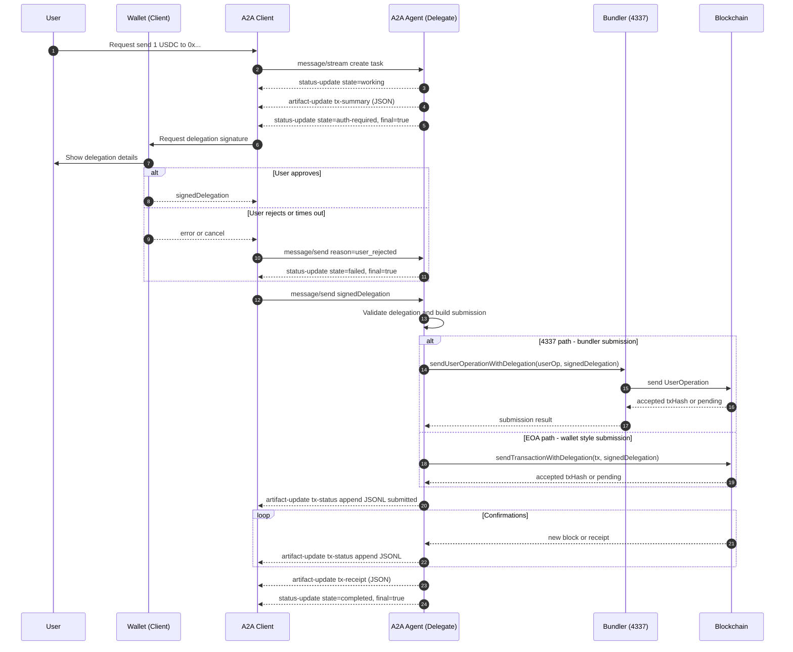

```mermaid
sequenceDiagram
    autonumber
    participant U as User
    participant W as Wallet (Client)
    participant C as A2A Client
    participant A as A2A Agent (Delegate)
    participant B as Bundler (4337)
    participant CH as Blockchain

    %% Turn A - Initiation and preview (stream 1)
    U->>C: Request send 1 USDC to 0x...
    C->>A: message/stream create task
    A-->>C: status-update state=working
    A-->>C: artifact-update tx-summary (JSON)
    A-->>C: status-update state=auth-required, final=true


    %% Turn B - Delegation signing (client side)
    C->>W: Request delegation signature
    W->>U: Show delegation details
    alt User approves
        W-->>C: signedDelegation
    else User rejects or times out
        W-->>C: error or cancel
        C->>A: message/send reason=user_rejected
        A-->>C: status-update state=failed, final=true
    end

    %% Turn C - Send delegation to delegate (new stream)
    C->>A: message/send signedDelegation

    %% Turn D - Build submission from delegation
    A->>A: Validate delegation and build submission

    %% Turn E - Redeem and broadcast (two paths)
    alt 4337 path - bundler submission
        A->>B: sendUserOperationWithDelegation(userOp, signedDelegation)
        B->>CH: send UserOperation
        CH-->>B: accepted txHash or pending
        B-->>A: submission result
    else EOA path - wallet style submission
        A->>CH: sendTransactionWithDelegation(tx, signedDelegation)
        CH-->>A: accepted txHash or pending
    end

    %% Turn F - Tracking confirmations
    A-->>C: artifact-update tx-status append JSONL submitted
    loop Confirmations
        CH-->>A: new block or receipt
        A-->>C: artifact-update tx-status append JSONL
    end

    %% Turn G - Completion
    A-->>C: artifact-update tx-receipt (JSON)
    A-->>C: status-update state=completed, final=true

```
