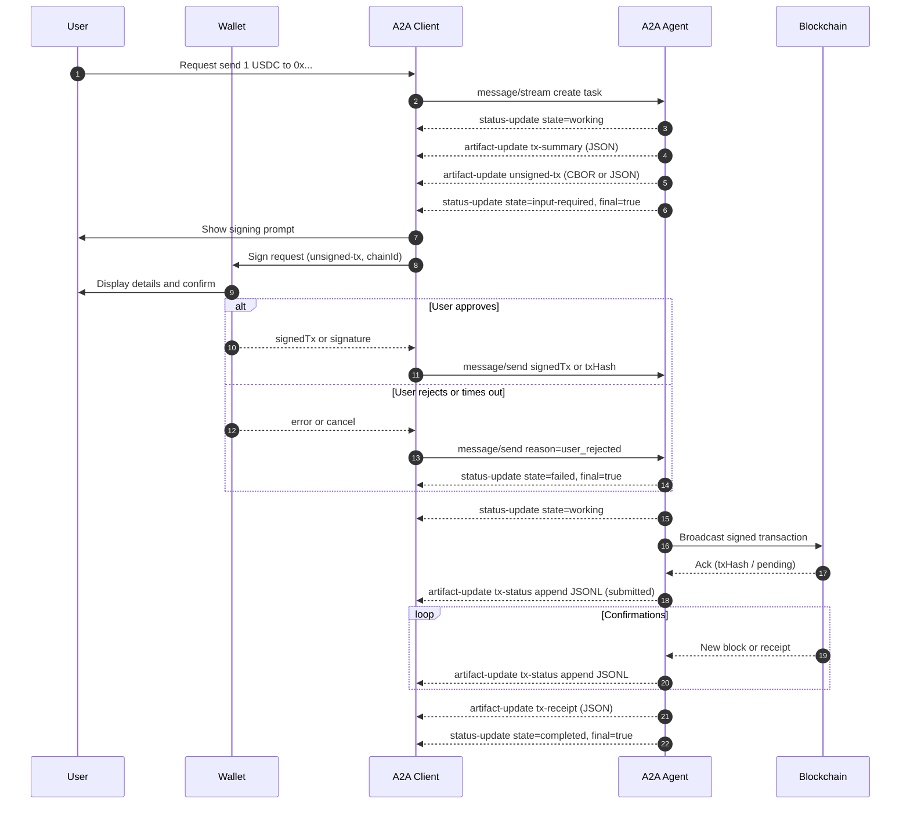

```mermaid
sequenceDiagram
    autonumber
    participant U as User
    participant W as Wallet
    participant C as A2A Client
    participant A as A2A Agent
    participant CH as Blockchain

    %% Turn A — Initiation & preview
    U->>C: Request send 1 USDC to 0x...
    C->>A: message/stream create task
    A-->>C: status-update state=working
    A-->>C: artifact-update tx-summary (JSON)

    %% Turn B — Request signature (pause)
    A-->>C: artifact-update unsigned-tx (CBOR or JSON)
    A-->>C: status-update state=input-required, final=true

    %% Turn C — User signs with non-custodial wallet
    C->>U: Show signing prompt
    C->>W: Sign request (unsigned-tx, chainId)
    W->>U: Display details and confirm
    alt User approves
        W-->>C: signedTx or signature
        C->>A: message/send signedTx or txHash
    else User rejects or times out
        W-->>C: error or cancel
        C->>A: message/send reason=user_rejected
        A-->>C: status-update state=failed, final=true
    end

    %% Submission to chain
    A-->>C: status-update state=working
    A->>CH: Broadcast signed transaction
    CH-->>A: Ack (txHash / pending)

    %% Turn D — Tracking confirmations
    A-->>C: artifact-update tx-status append JSONL (submitted)
    loop Confirmations
        CH-->>A: New block or receipt
        A-->>C: artifact-update tx-status append JSONL
    end

    %% Turn E — Completion
    A-->>C: artifact-update tx-receipt (JSON)
    A-->>C: status-update state=completed, final=true
```
